# UniTab 标签处理与远程同步机制流程图

## 1. 整体架构概览

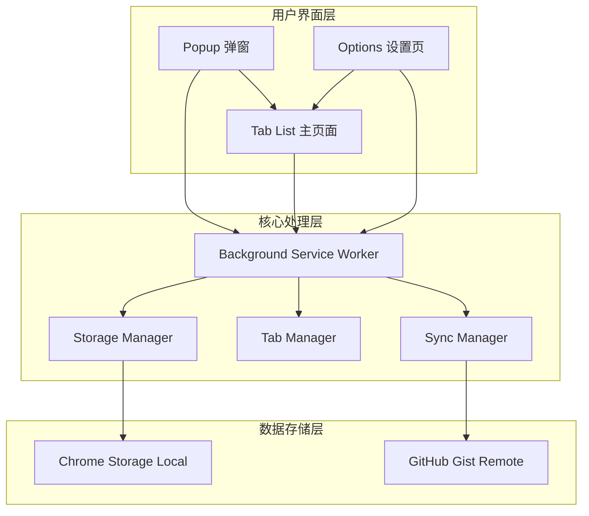

## 2. 标签处理流程

### 2.1 标签聚合流程

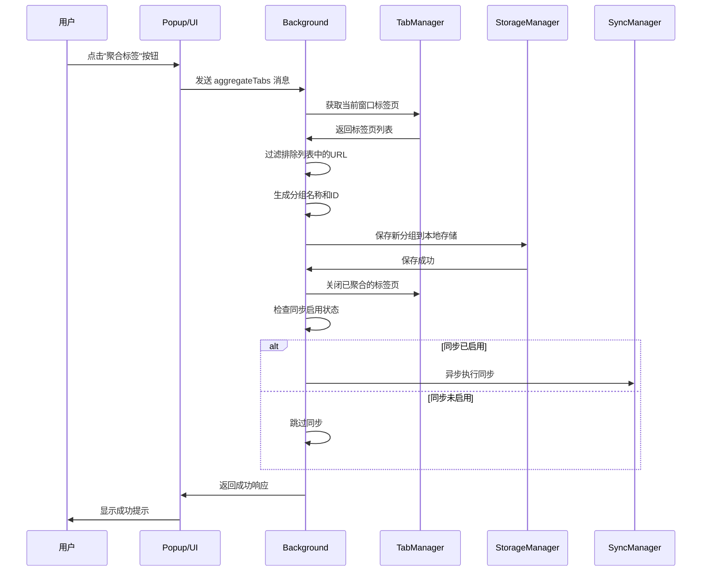

### 2.2 标签恢复流程

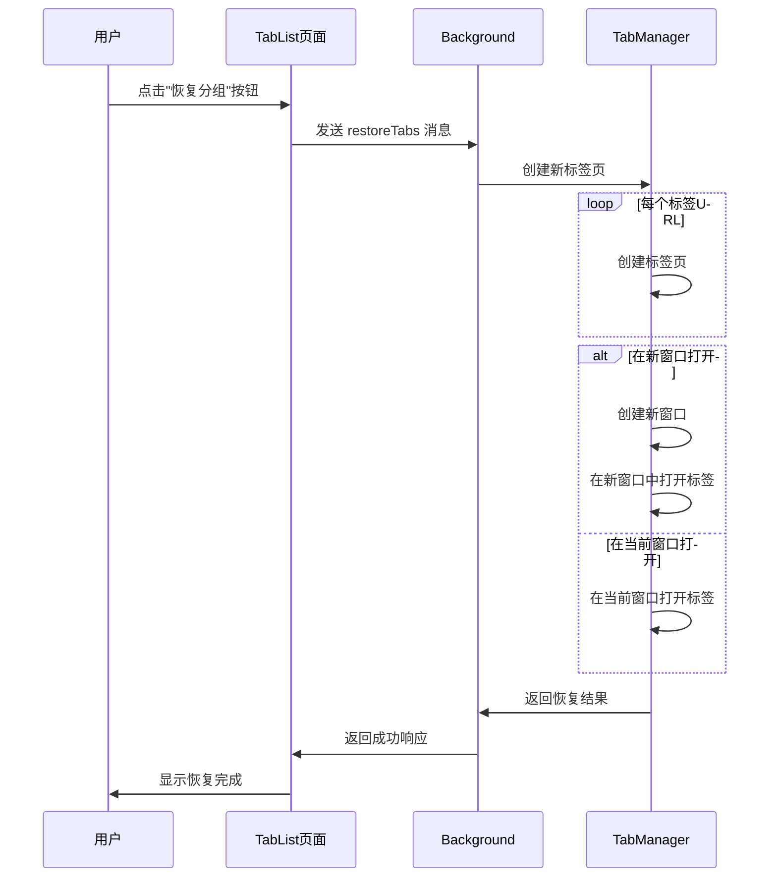

### 2.3 分组管理流程

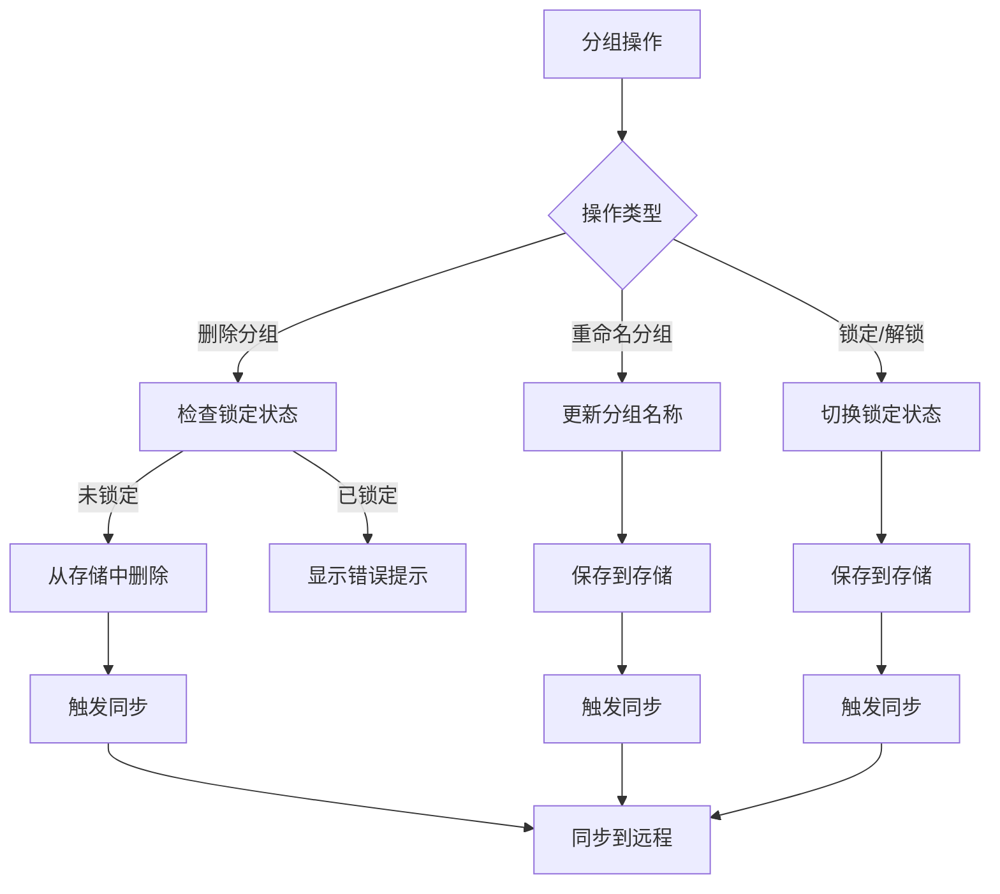

## 3. 远程同步机制

### 3.1 同步系统初始化流程

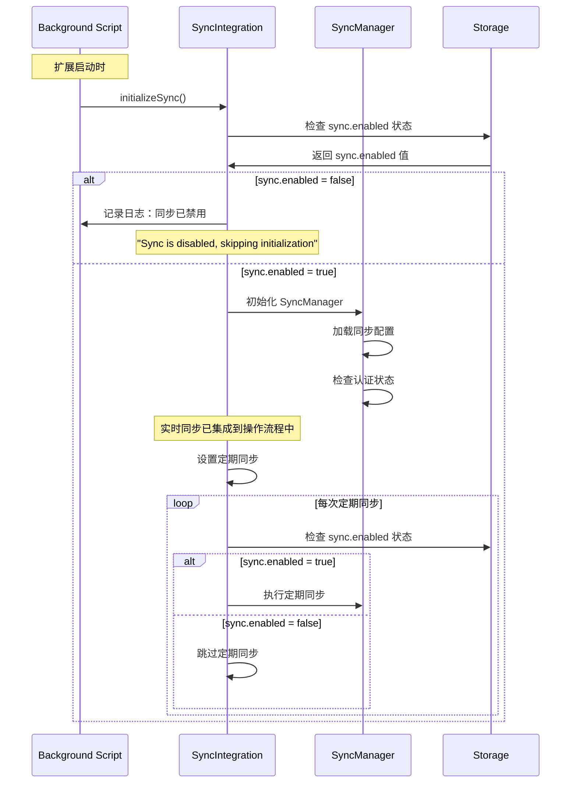

### 3.2 同步系统架构

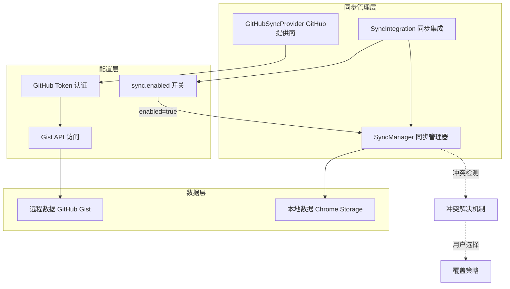

### 3.3 手动同步流程

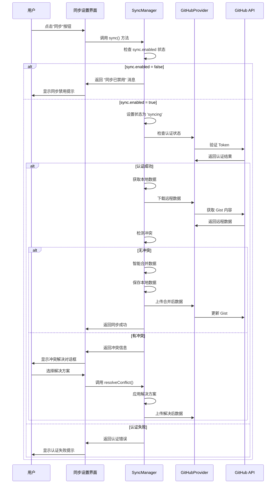

### 3.4 实时同步流程

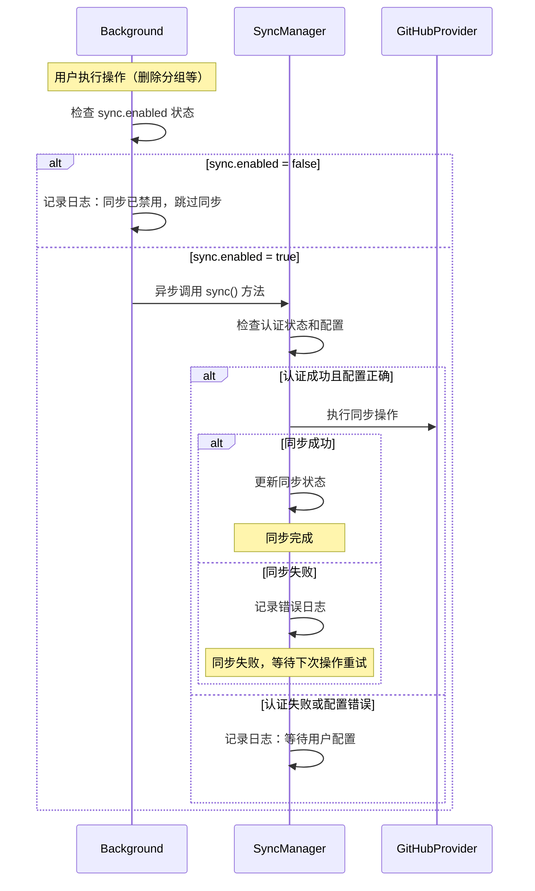

### 3.5 冲突检测与解决流程

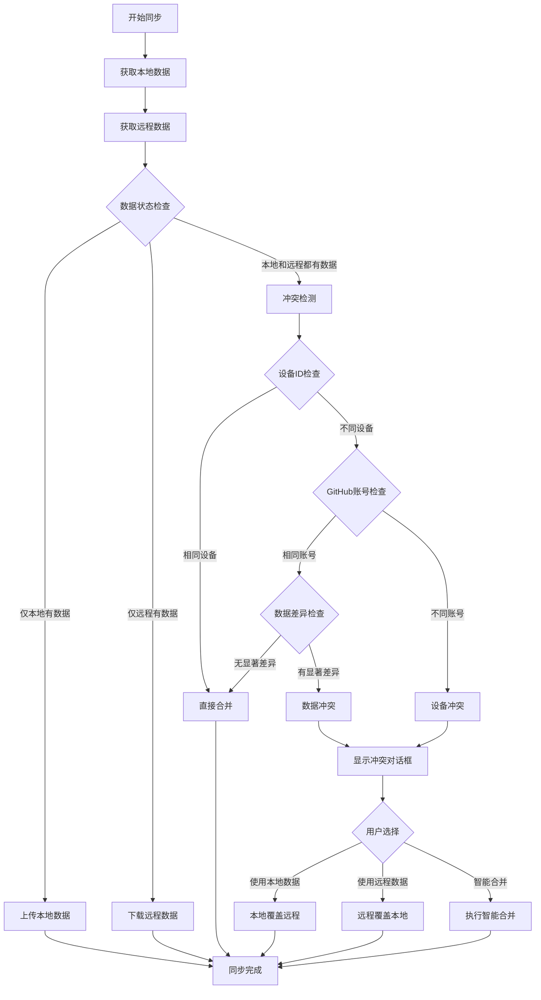

## 4. 数据流向图

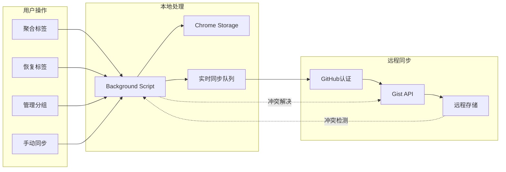

## 5. 关键组件说明

### 5.1 核心组件职责

| 组件 | 职责 | 关键方法 |
|------|------|----------|
| **Background Script** | 消息处理、业务逻辑协调 | `aggregateCurrentWindowTabs()`, `deleteGroup()`, `restoreTabs()` |
| **SyncIntegration** | 同步系统集成、初始化控制 | `initializeSync()`, `setupPeriodicSync()`, `checkSyncEnabled()` |
| **SyncManager** | 同步逻辑管理、冲突处理 | `sync()`, `upload()`, `download()`, `enableAutoSync()`, `detectConflict()`, `resolveConflict()` |

| **GitHubSyncProvider** | GitHub API 交互 | `upload()`, `download()`, `isAuthenticated()` |
| **StorageManager** | 本地数据管理 | `getData()`, `setData()` |

### 5.2 数据同步策略

1. **同步启用检查**：
   - 所有同步操作前都会检查 `sync.enabled` 状态
   - 系统初始化时检查是否启用同步功能
   - 定期同步和实时同步都遵循此检查
   - 禁用时跳过所有同步操作并记录日志

2. **实时同步触发**：
   - 所有数据变更操作后都会检查同步状态
   - 如果同步启用且配置正确，则异步执行同步
   - 同步失败不影响用户操作，会在下次操作时重试

3. **冲突解决策略**：
   - 同设备：直接合并
   - 同账号不同设备：检查数据差异
   - 不同账号：提示用户选择

4. **简化的错误处理**：
   - 同步失败时记录日志但不阻塞用户操作
   - 依赖下次操作或定期同步来重试
   - 用户可以手动触发同步来解决问题

## 6. 错误处理机制

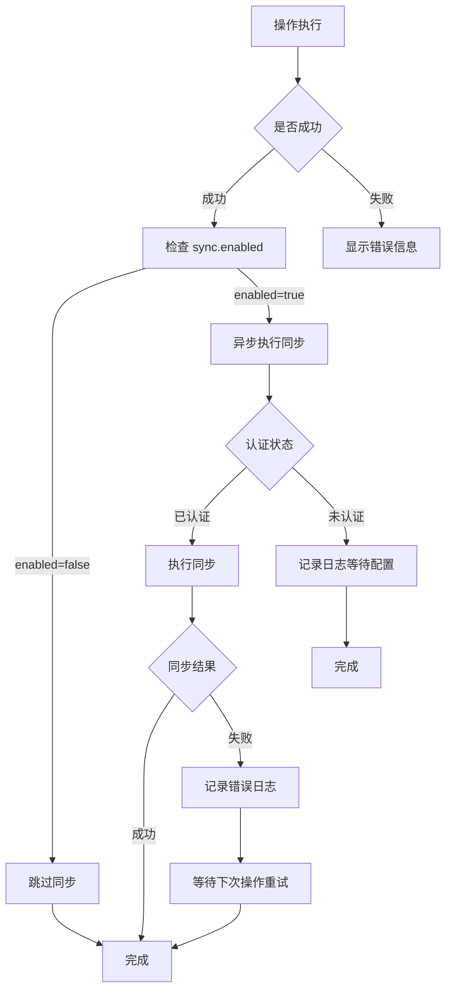

## 7. 远程同步设计方案详细说明

### 7.1 设计目标

本方案旨在为 UniTab 设计一个健壮、可靠、支持离线操作的多设备数据同步机制。

* **数据一致性:** 确保用户在设备 A、B、C 上的数据，在与远程服务器同步后，能够达到最终一致。
* **离线优先:** 用户可以随时断开远程连接，在纯本地模式下无缝进行所有操作（增、删、改）。
* **智能重连:** 当用户重新启用同步时，系统能够智能合并离线期间的本地修改和云端的变更。
* **冲突解决:** 优雅地处理并发修改导致的冲突，最大限度地避免数据丢失。

### 7.2 核心原则

1. **单一事实来源 (Single Source of Truth):** 当连接时，远程 GitHub Gist 存储的数据被视为最高权威的"主版本"。
2. **元数据驱动 (Metadata-Driven):** 所有同步决策都基于元数据（最后修改时间、同步开关状态等）。
3. **乐观锁 & 三路合并:** 沿用此前的核心策略。在写入前检查远程状态，并在冲突时执行三路合并。

### 7.3 数据结构扩展

在 settings 中增加一个关键的布尔值字段 sync.enabled。

```json
{
  "version": "1.2.0",
  "metadata": {
    "lastModified": "2025-07-15T12:30:00.123Z",
    "lastSyncTimestamp": "2025-07-15T12:25:00.000Z",
    "deviceId": "device_unique_id_A"
  },
  "settings": {
    "sync": {
      "enabled": true, // <-- 核心开关
      "provider": "github",
      "gistId": "YOUR_GIST_ID"
    },
    "excludeList": [ "localhost" ]
  },
  "groups": [ ... ] // 结构不变
}
```

### 7.4 同步状态与流程

#### 7.4.1 状态定义

* **在线模式 (Sync Enabled):** settings.sync.enabled 为 true。插件会在启动、本地修改后、定时触发自动同步流程。
* **离线模式 (Sync Disabled):** settings.sync.enabled 为 false。插件不会执行任何网络请求，所有操作都只影响本地 chrome.storage。

#### 7.4.2 更新后的同步流程图

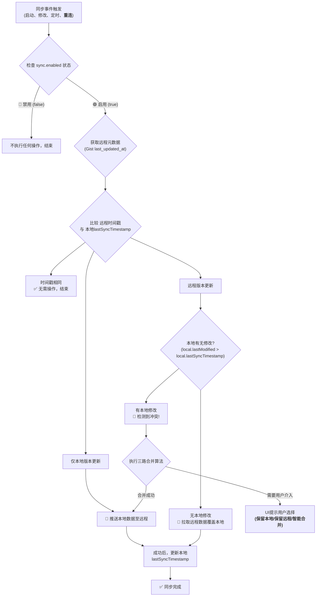

#### 7.4.3 关键场景处理

1. **断开同步 (用户操作):**
   * 用户在选项页关闭同步开关。
   * 插件将 settings.sync.enabled 设置为 false。
   * 所有正在进行的或计划中的同步任务都将取消。
   * 此时 lastSyncTimestamp 将被"冻结"，成为未来恢复同步时的重要基准。

2. **离线期间操作:**
   * 用户正常进行增、删、改分组和标签页。
   * 每次修改都会更新 metadata.lastModified 时间戳，但 lastSyncTimestamp 保持不变。

3. **重新连接同步 (用户操作):**
   * 用户在选项页重新打开同步开关。
   * 这会立即触发一次手动的、高优先级的 **"同步事件"**。
   * 流程启动，进入流程图的 A 点。
   * 系统会发现 remote_timestamp (来自 Gist) 和 local.lastModified 都可能大于被"冻结"的 lastSyncTimestamp，这会大概率导向 K_CONFLICT (冲突检测)。
   * **冲突处理:**
     * 系统执行 **三路合并** 算法。
     * **如果可以自动合并** (例如，云端新增了一个分组，本地修改了另一个分组的名称)，则自动完成并推送。
     * **如果发生复杂冲突** (例如，云端和本地都修改了同一个分组的名称)，则必须由用户介入。插件将弹出一个模态框，提供清晰的选项：
       * **保留云端版本**: 放弃所有本地离线修改，用云端数据完全覆盖本地。
       * **保留本地版本**: 用本地数据覆盖云端版本，这可能会导致其他设备的修改丢失。
       * 尝试智能合并: (默认推荐) 执行三路合并算法，并展示合并预览（如果可行）。

---

*此流程图描述了 UniTab 浏览器扩展的完整标签处理和远程同步机制，包括用户操作流程、数据同步策略、冲突解决方案和错误处理机制。*