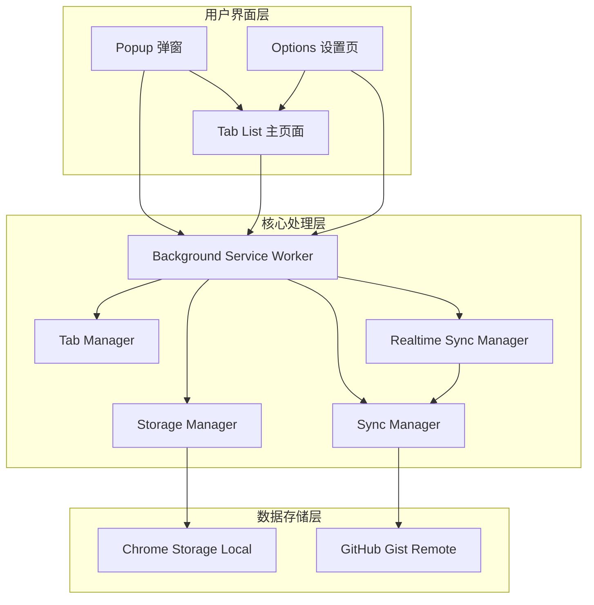
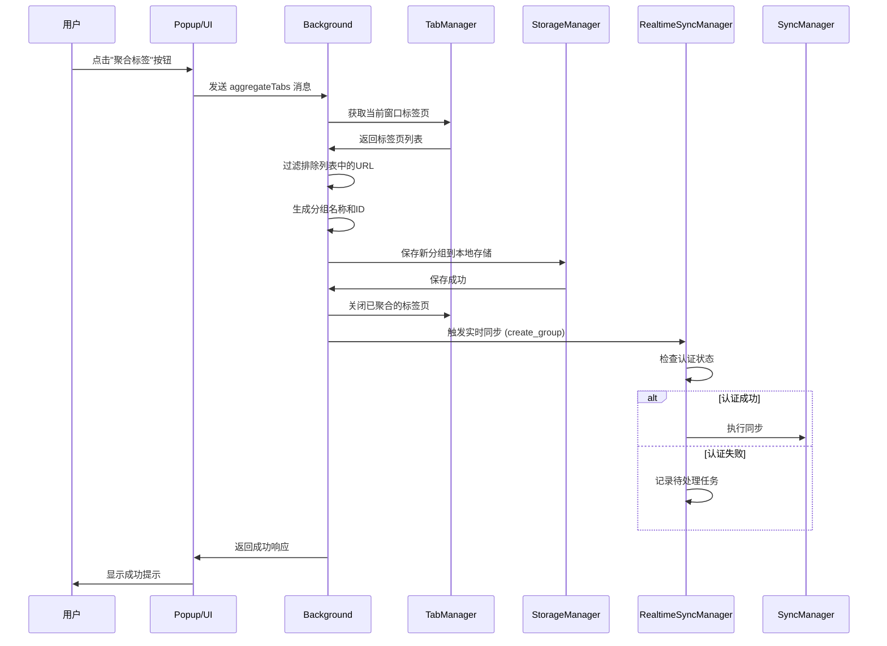
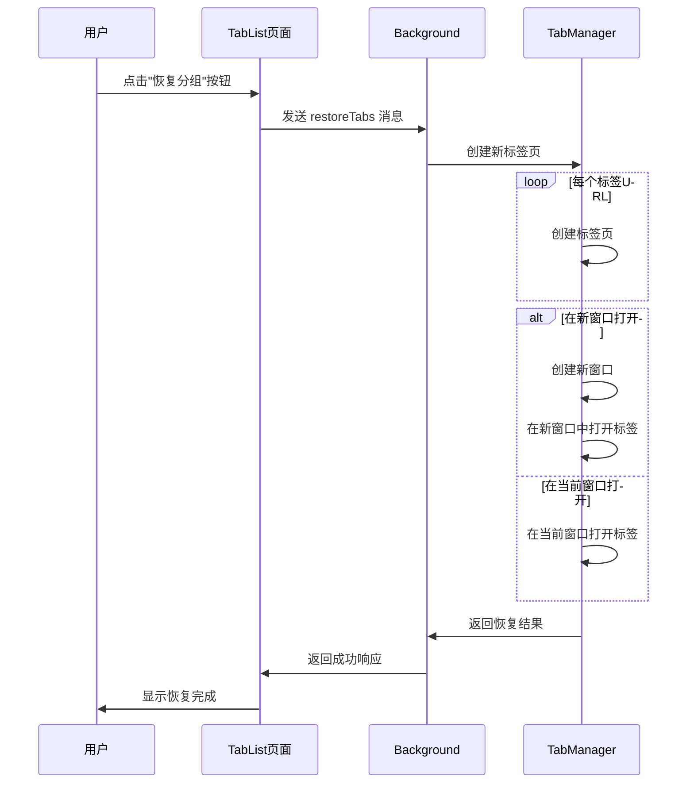
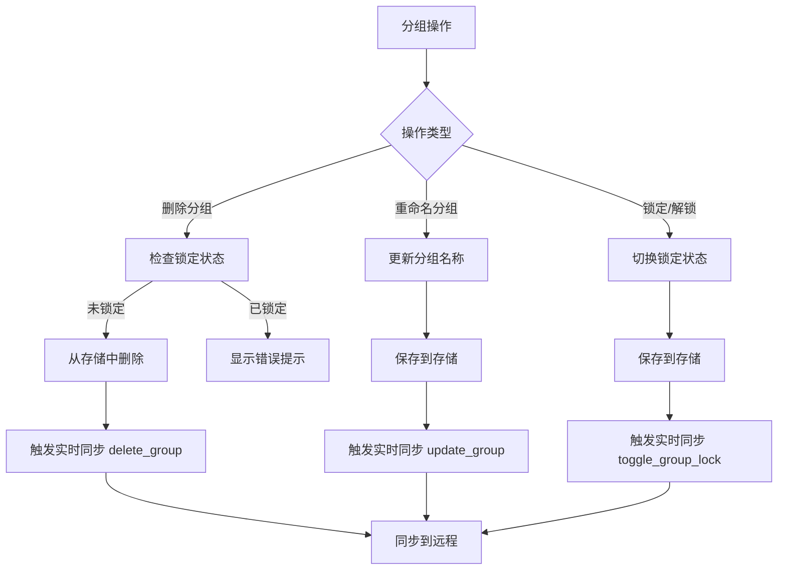
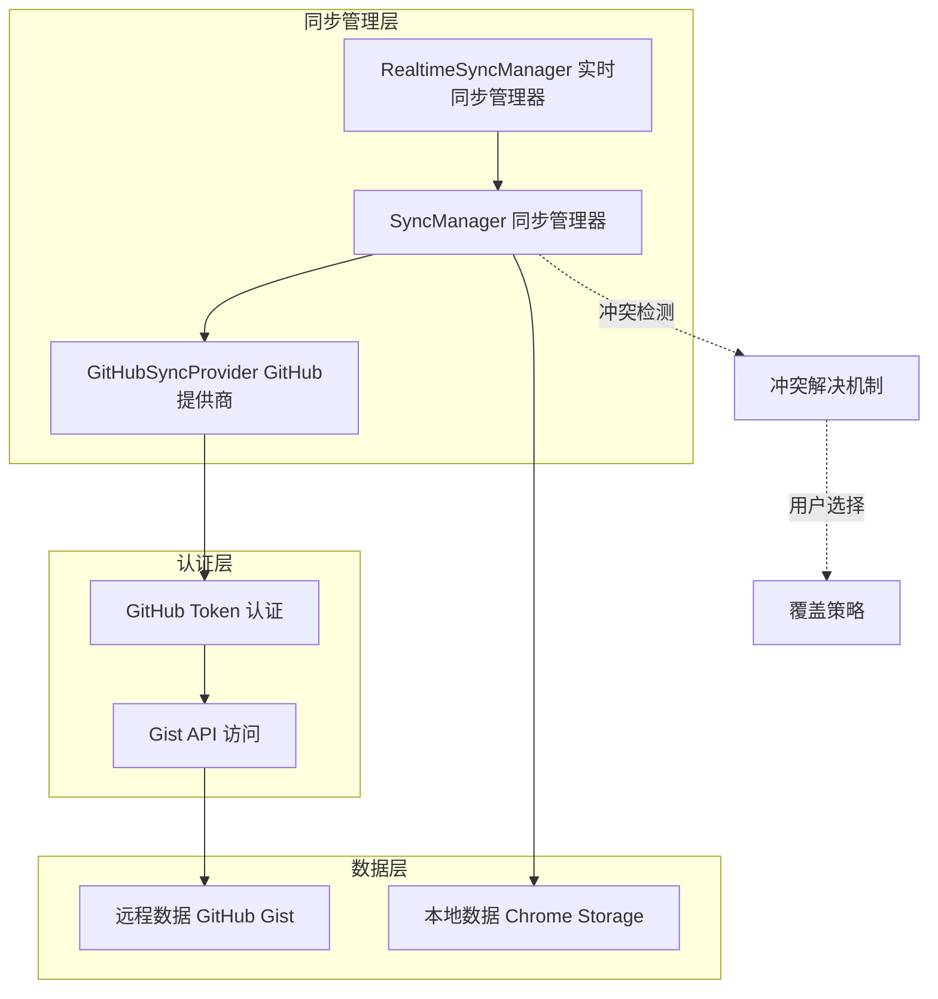
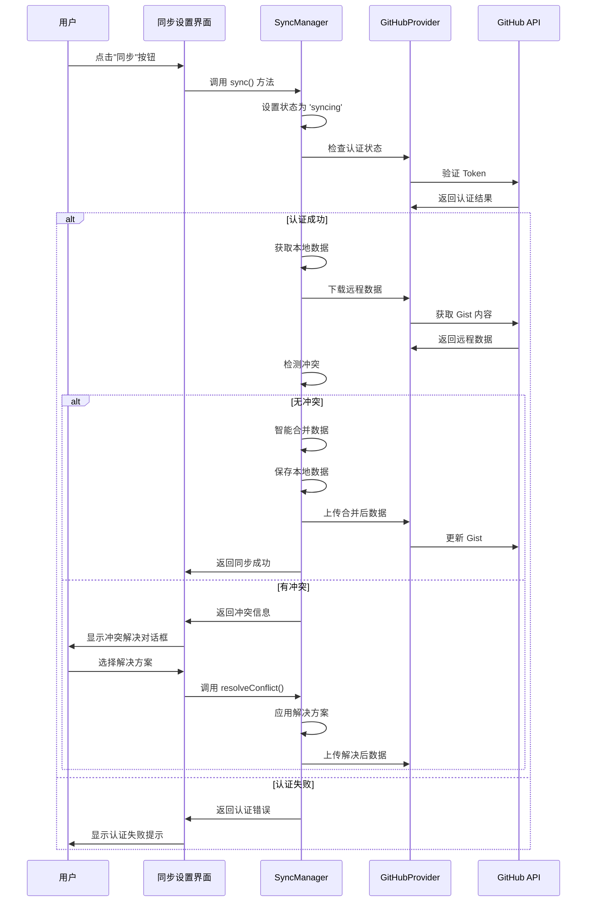
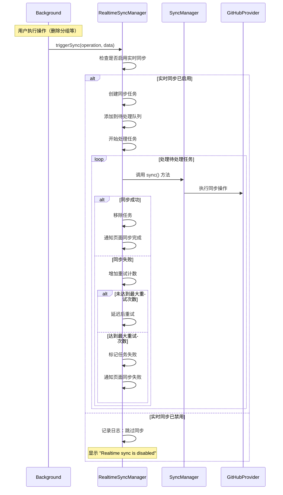
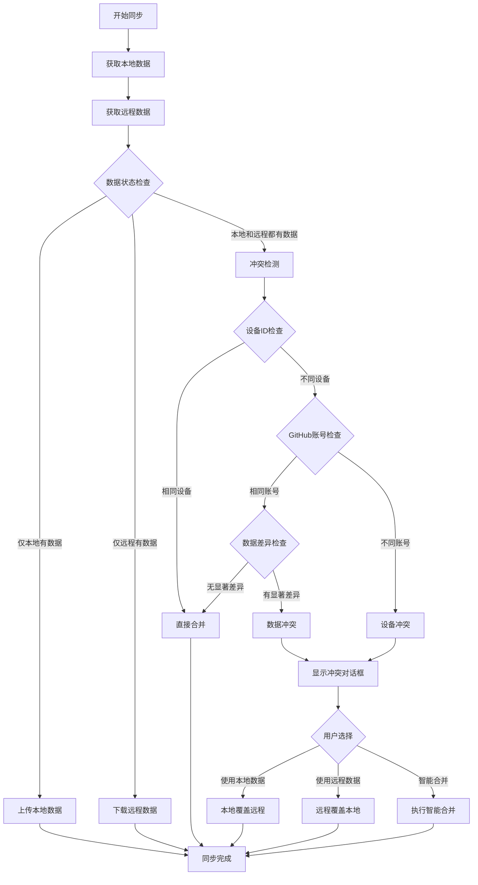
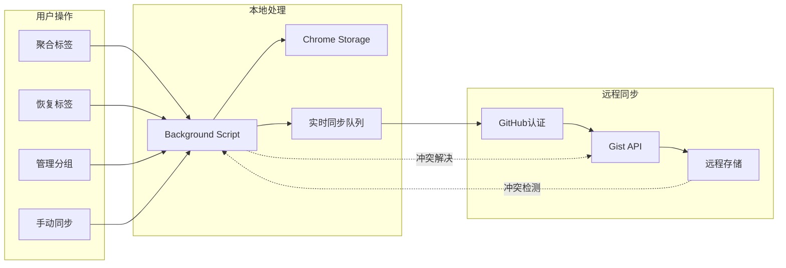
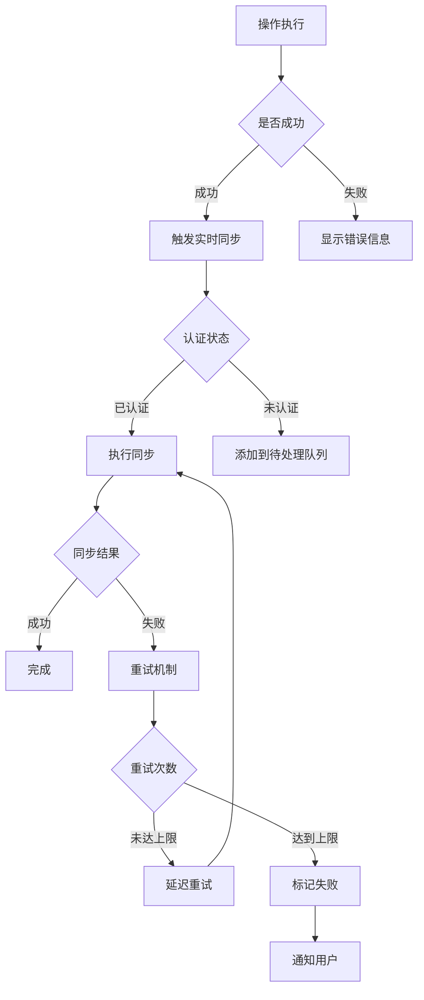

# UniTab 标签处理与远程同步机制流程图

## 1. 整体架构概览

## 2. 标签处理流程

### 2.1 标签聚合流程

### 2.2 标签恢复流程

### 2.3 分组管理流程

## 3. 远程同步机制

### 3.1 同步系统架构

### 3.2 手动同步流程

### 3.3 实时同步流程

### 3.4 冲突检测与解决流程

## 4. 数据流向图

## 5. 关键组件说明

### 5.1 核心组件职责

| 组件 | 职责 | 关键方法 |
|------|------|----------|
| **Background Script** | 消息处理、业务逻辑协调 | `aggregateCurrentWindowTabs()`, `deleteGroup()`, `restoreTabs()` |
| **SyncManager** | 同步逻辑管理、冲突处理 | `sync()`, `detectConflict()`, `resolveConflict()` |
| **RealtimeSyncManager** | 实时同步任务管理 | `triggerSync()`, `processPendingTasks()` |
| **GitHubSyncProvider** | GitHub API 交互 | `upload()`, `download()`, `isAuthenticated()` |
| **StorageManager** | 本地数据管理 | `getData()`, `setData()` |

### 5.2 数据同步策略

1. **实时同步触发条件**：
   - 创建分组 (`create_group`)
   - 更新分组 (`update_group`)
   - 删除分组 (`delete_group`)
   - 切换锁定状态 (`toggle_group_lock`)
   - 聚合标签 (`aggregate_tabs`)

2. **冲突解决策略**：
   - 同设备：直接合并
   - 同账号不同设备：检查数据差异
   - 不同账号：提示用户选择

3. **重试机制**：
   - 最大重试次数：3次
   - 退避策略：指数退避
   - 基础延迟：1秒
   - 最大延迟：30秒

## 6. 错误处理机制

---

*此流程图描述了 UniTab 浏览器扩展的完整标签处理和远程同步机制，包括用户操作流程、数据同步策略、冲突解决方案和错误处理机制。*